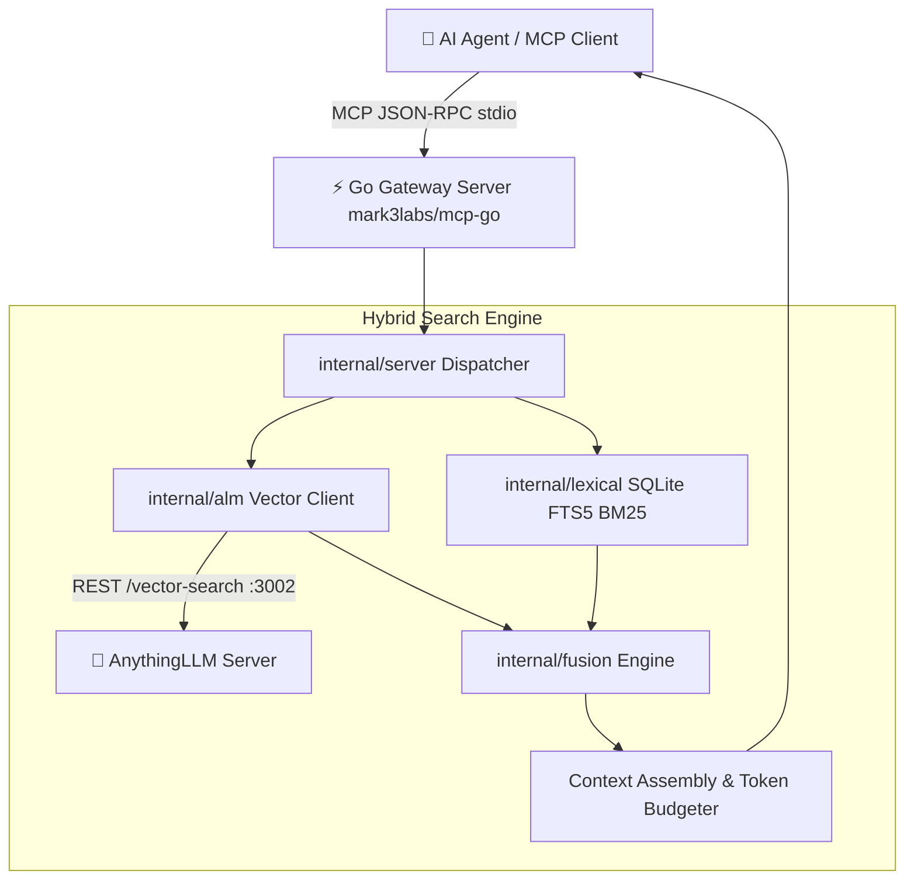

# 📐 anythingllm-mcp-gateway Architecture & Design Specification

- **Package:** `github.com/TheNovaNodes/anythingllm-mcp-gateway`
- **Stack:** Go 1.25 / mark3labs/mcp-go / modernc.org/sqlite / AnythingLLM REST API
- **Protocol:** Model Context Protocol (MCP) over Stdio
- **Status:** Active / Production-Grade

---

## 🏛️ 1. Architecture Overview

`anythingllm-mcp-gateway` is a production-grade data plane gateway connecting AI agents to AnythingLLM semantic memory through a high-performance, typed MCP interface.



---

## 🔬 2. Mathematical & Algorithmic Models

### 2.1. Reciprocal Rank Fusion (RRF) & Score Calibration
The fusion engine normalizes raw vector cosine distances and lexical BM25 scores to combine semantic similarity with lexical precision:

$$RRF(d) = \sum_{m \in M} \frac{w_m}{k + r_m(d)}$$

Where:
- $M = \{\text{vector}, \text{lexical}\}$
- $k = 60$ (smoothing constant)
- $w_{\text{vec}} = 0.6$, $w_{\text{lex}} = 0.4$ (semantic priority with lexical guardrails)

### 2.2. Temporal Decay Scaling
To prevent agents from relying on obsolete decisions, documents incur an exponential temporal penalty based on elapsed days ($\Delta t$):

$$D_{\text{temporal}} = \max\left(0.6, \exp(-\lambda \cdot \Delta t_{\text{days}})\right)$$

Where $\lambda = 0.005$. Modern documentation receives a multiplier of $1.0$, while documentation older than 6 months gradually levels out at the floor value of $0.6$.

### 2.3. Adaptive Token Budgeting
When `max_token_budget` is supplied:
1. Cumulative token counts are tracked on a 4-char heuristic per token.
2. If adding the next passage would exceed the budget, the passage is cleanly sliced on sentence/paragraph boundaries.
3. The response flags `trimmed_to_budget: true` so the agent is aware of the context constraint.

---

## 📦 3. Package Organization

- **`main.go`**  
  Entrypoint initializing environment variables, configuring `alm.Client`, setting up `lexical.DB`, and serving stdio MCP.

- **`internal/alm/`**  
  High-throughput HTTP client for AnythingLLM:
  - Connection pooling with `http.Transport` (reusable TCP sockets).
  - 401 Unauthorized detection and bearer token retry mechanism.
  - Endpoints: vector query search, raw-text document upload, workspace embeddings sync.

- **`internal/lexical/`**  
  Pure Go SQLite FTS5 database (`modernc.org/sqlite`):
  - Inverted full-text index with BM25 ranking.
  - Zero CGO dependencies for maximum portability and fast compilation.

- **`internal/fusion/`**  
  Hybrid search ranking and context formatting:
  - Reciprocal rank fusion merge algorithm (`rrf.go`).
  - Context expansion from matched snippets to full paragraphs (`context.go`).

- **`internal/server/`**  
  MCP tool handlers (`server.go`):
  - Schema definitions for `search_memory`, `store_memory`, `get_document`, and `gateway_health`.

---

## ⚡ 4. Resource & Latency Profile

- **RAM Footprint:** ~13 MB in steady state (compared to ~85 MB with Python FastMCP).
- **Zero-CGO:** Built with pure Go SQLite driver, allowing static compilation and containerization without glibc.
- **Concurrency Guard:** Bounded inflight semaphore (`MG_VECTOR_MAX_INFLIGHT`) prevents agent swarm thundering herd problems on the AnythingLLM backend.

---

## 🧪 5. Testing & Verification

```bash
# Run unit and race tests
go test -v -race -cover ./...
```
