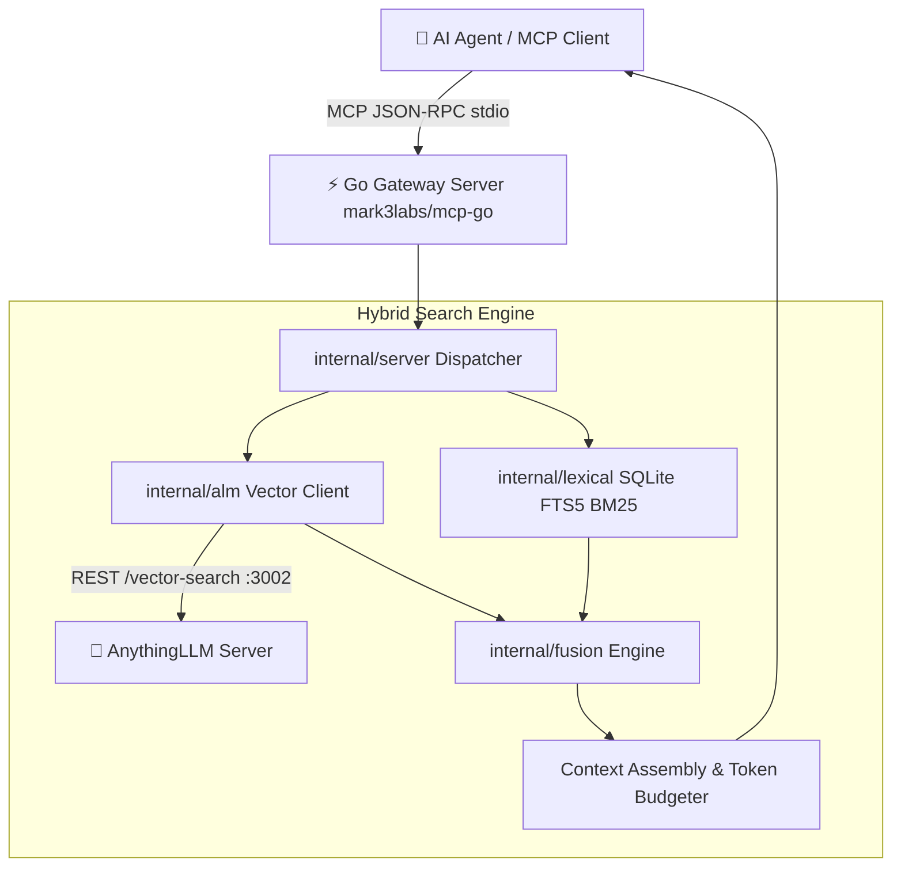

# 📐 anythingllm-mcp-gateway Architecture & Design Specification

- **Package:** `github.com/TheNovaNodes/anythingllm-mcp-gateway`
- **Stack:** Go 1.25 / mark3labs/mcp-go / modernc.org/sqlite / AnythingLLM REST API
- **Protocol:** Model Context Protocol (MCP) over Stdio
- **Status:** Active / Production-Grade

---

## 🏛️ 1. Architecture Overview

`anythingllm-mcp-gateway` is a production-grade data plane gateway connecting AI agents to AnythingLLM semantic memory through a high-performance, typed MCP interface.


```mermaid
graph TD
    Client[🤖 AI Agent / MCP Client] -->|MCP JSON-RPC stdio| Gateway[⚡ Go Gateway Server mark3labs/mcp-go]
    Gateway --> Dispatch[internal/server Dispatcher]

    subgraph Hybrid Search Engine
        Dispatch --> Vector[internal/alm Vector Client]
        Dispatch --> Lexical[internal/lexical SQLite FTS5 BM25]
        Vector -->|REST /vector-search :3002| ALM[🧠 AnythingLLM Server]
        Vector --> Fusion[internal/fusion Engine]
        Lexical --> Fusion
        Fusion --> Assembly[Context Assembly & Token Budgeter]
    end

    Assembly --> Client
```

---

## 🔬 2. Mathematical & Algorithmic Models

### 2.1. Reciprocal Rank Fusion (RRF) & Exact Match Boosting
The fusion engine combines dense vector search with SQLite FTS5 BM25 lexical search using Reciprocal Rank Fusion augmented with exact match boosting:

$$RRF(d) = \left( \sum_{m \in M} \frac{1}{k + r_m(d)} + B_{\text{exact}} \right) \times B_{\text{workspace}}$$

Where:
- $M \subseteq \{\text{vector}, \text{lexical}\}$
- $k = 60$ (smoothing constant)
- $B_{\text{exact}} = +0.02$ for high-confidence BM25 hits ($\text{score} \ge 5.0$), $+0.03$ for exact title/path substring matches.
- $B_{\text{workspace}} = 1.35\times$ (max $2.5\times$) for matching query workspace tokens.

### 2.2. Multi-Tenant Organization Isolation
Before fusion, vector and lexical candidates pass through an organizational filter (`FilterVectorHitsByOrg` / `FilterLexicalHitsByOrg`). Candidates whose derived organization slug does not match the configured `MG_ALLOWED_ORGS` scope are dropped before rank calculation.

### 2.3. BM25 Column Weighting & Compound Tokenization
Lexical search against `docs_fts` uses column-weighted BM25 score calculation:

$$\text{BM25}_{\text{score}} = \text{bm25}(\text{docs\_fts}, 5.0, 10.0, 0.0, 1.0)$$

Which assigns weights: $\text{path} = 5.0$, $\text{title} = 10.0$, $\text{workspace} = 0.0$, $\text{content} = 1.0$.
Queries are pre-processed by `BuildSafeFTSQuery` to split `camelCase`, `PascalCase`, `kebab-case`, and `snake_case` compound tokens into exact sub-tokens.

### 2.4. Vector Score Drift Sanitization & Pure-Vector Cutoff
Vector search results returned by AnythingLLM are filtered for distance anomalies:
1. Hits with cosine distance $\ge 0.85$ or score inversion anomalies ($r.\text{Score} \ge 0.99 \land r.\text{Distance} > 0.5$) are discarded prior to RRF processing.
2. In the fusion layer, pure-vector candidates without lexical corroboration (`hasVec && !hasLex`) are pruned if $\text{VectorScore} < \text{MinPureVectorSimilarity}$ (configurable via `MG_MIN_VECTOR_SIMILARITY`, default $0.55$). This prevents uncalibrated dense embedding noise from injecting out-of-domain false positives.

### 2.5. Semantic Document Chunking & Document-Level Aggregation
Long documentation and markdown essays are segmented using a sliding window chunker (`internal/etl/chunk.go`):
- **Window Geometry:** Target size of 512 tokens (~2048 characters) with an adaptive 64-token overlap (~256 characters) anchored on natural sentence and paragraph boundaries (`\n\n`, `\n`, `. `, `? `, `! `).
- **Chunk Metadata:** Chunks are indexed into AnythingLLM and `lexical.db` with structured metadata anchors (`chunk_index`, `total_chunks`, `parent_doc_id`).
- **Retrieval Modes (`group_by`):**
  - `chunk`: Returns individual high-scoring semantic windows with surrounding paragraph expansion for precise localization.
  - `document`: Aggregates chunk-level RRF scores to parent document level via `GroupByDocument`, returning the single most representative window per file to eliminate duplicate hits from the same document.
- **Reassembly:** `get_document` automatically detects chunked indexes and concatenates all indexed segments in canonical ordinal order to reconstitute the original file.

### 2.6. FTS5-First Candidate Workspace Routing
When `workspace` is omitted in `search_memory`:
1. The local SQLite FTS5 index (`lexical.db`) executes first with sub-millisecond latency (<2ms).
2. Distinct candidate workspaces are extracted from the top lexical matches and ranked by BM25 relevance (capped at top 5 workspaces).
3. Dense vector search is executed **exclusively** against these candidate workspaces (plus configured default workspace), instead of querying all 33+ system workspaces.
4. If no lexical hits are found (abstract/out-of-vocabulary query), vector search falls back to discovered workspaces with bounded concurrency (capped at 8) to eliminate thundering herd timeouts.

---

## 📦 3. Package Organization

- **`main.go`**  
  Entrypoint initializing environment variables, configuring `alm.Client`, setting up `lexical.DB`, and serving stdio MCP.

- **`cmd/anythingllm-sync/`**  
  Entrypoint for autonomous background ETL synchronization CLI and systemd daemon. Traverses project Markdown documents, calculates SHA-256 hashes, maintains `etl_ledger.sqlite`, indexes into `lexical.db`, and updates AnythingLLM vector embeddings.

- **`internal/alm/`**  
  High-throughput HTTP client for AnythingLLM:
  - Connection pooling with `http.Transport` (reusable TCP sockets).
  - 401 Unauthorized detection and bearer token retry mechanism.
  - Endpoints: vector query search, raw-text document upload, workspace embeddings sync, workspace discovery and management.

- **`internal/etl/`**  
  Autonomous synchronization and deduplication engine:
  - `dedup.go`: SQLite-backed state store (`modernc.org/sqlite`). Tracks file paths, mtimes, SHA-256 hashes, and tombstones.
  - `filter.go`: Path filtering, blacklisting (`.git`, `.venv`, `node_modules`, snapshot repos), and workspace slug derivation.
  - `pipeline.go`: Orchestrator traversing repositories, ensuring workspace presence, and purging tombstones.
  - `lexical.go`: Manages `docs_fts` FTS5 index in `lexical.db`.

- **`internal/lexical/`**  
  Pure Go SQLite FTS5 database (`modernc.org/sqlite`):
  - Inverted full-text index with BM25 ranking.
  - Zero CGO dependencies for maximum portability and fast compilation.

- **`internal/fusion/`**  
  Hybrid search ranking and context formatting:
  - Reciprocal rank fusion merge algorithm (`rrf.go`).
  - Context expansion from matched snippets to full paragraphs (`context.go`).

- **`internal/server/`**  
  MCP tool handlers (`server.go`):
  - Schema definitions for `search_memory`, `get_document`, and `gateway_health`.

---

## ⚡ 4. Resource & Latency Profile

- **RAM Footprint:** ~13 MB in steady state (compared to ~85 MB with Python FastMCP).
- **Zero-CGO:** Built with pure Go SQLite driver, allowing static compilation and containerization without glibc.
- **Concurrency Guard:** Bounded inflight semaphore (`MG_VECTOR_MAX_INFLIGHT`) prevents agent swarm thundering herd problems on the AnythingLLM backend.

---

## 🧪 5. Testing & Verification

```bash
# Run unit and race tests
go test -v -race -cover ./...
```

---

## ⚙️ 6. Environment Variables

The gateway relies on the following environment variables:
- `MG_ALLOWED_ORGS`: Comma-separated list of organization slugs allowed for multi-tenant isolation.
- `MG_MIN_VECTOR_SIMILARITY`: Minimum cosine similarity threshold for pure-vector candidates without lexical corroboration.
- `MG_ALM_BASE`: AnythingLLM REST API base endpoint.
- `MG_API_KEY`: AnythingLLM Bearer API key.
- `MG_WORKSPACE`: Default workspace slug for search and storage.
- `MG_LEXICAL_DB`: Path to SQLite database for FTS5 lexical search.
- `MG_RRF_K`: Reciprocal Rank Fusion smoothing constant.
