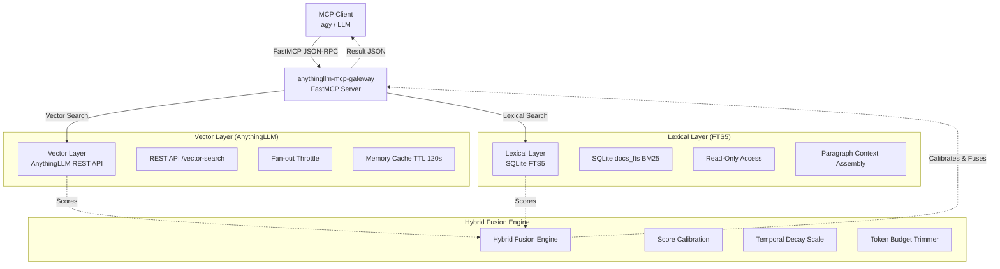

# Архитектура `anythingllm-mcp-gateway`

Данный документ описывает архитектуру и механизмы работы `anythingllm-mcp-gateway`, высокопроизводительного шлюза по протоколу Model Context Protocol (MCP).

## Визуализация Архитектуры

## Внутренняя Логика и Алгоритмы

### 1. Гибридный Поиск (Score-Calibrated Weighted Fusion)
Шлюз использует комбинацию семантического (векторного) и лексического (FTS5) поиска. В отличие от базового алгоритма Reciprocal Rank Fusion (RRF), шлюз применяет скоринговую нормализацию в диапазоне `[0, 1]`.

Формула:
`S_fused = α * MinMax(S_vec) + (1 - α) * MinMax(S_lex)`

Где `α = 0.6` по умолчанию, что отдает приоритет семантическому вектору, но сохраняет вес точных лексических совпадений из SQLite.

### 2. Учет Свежести Документов (Temporal Decay Scaling)
Для того чтобы ИИ не использовал устаревшие данные, к итоговому скору применяется экспоненциальное затухание в зависимости от возраста документа.

Формула:
`D_temporal = max(0.6, exp(-λ * Δt_days))`

Где `λ = 0.005`. Свежие документы имеют вес `1.0`, в то время как старые постепенно снижаются до порога в `0.6`.

### 3. Адаптивное Бюджетирование Токенов (Adaptive Token Budgeting)
Шлюз поддерживает ограничение выдачи по количеству токенов (`max_token_budget`). Когда бюджет приближается к концу:
- Размеры токенов вычисляются аппроксимацией (`символы / 4`).
- Последний фрагмент, превышающий бюджет, обрезается по границам предложений.
- В результат добавляется флаг `trimmed_to_budget: true`, сообщая клиенту о том, что результат был усечен.

### 4. Сборка Контекста (Context Assembly)
Когда параметр `expand_context` включен, результаты поиска расширяются за счет подтягивания соседних абзацев из оригинального документа (в пределах того же файла). Это обеспечивает агента более связным и полным контекстом для анализа, что критично для сложных логических рассуждений.
